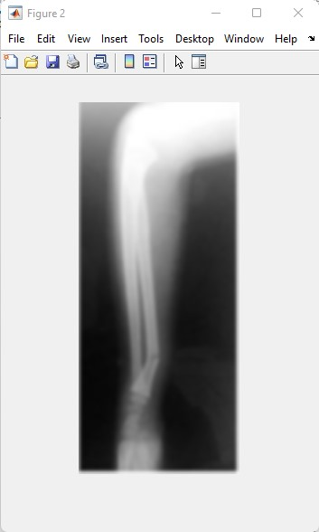
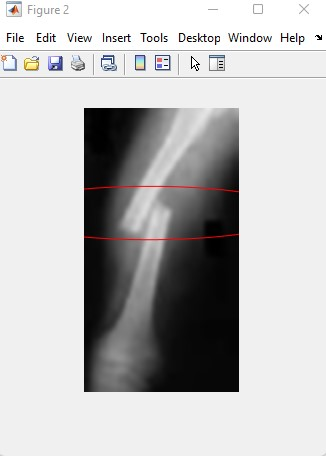

# Bone Fracture Detection
Bone Fracture Detecting System.
The system was built in Matlab, it can detect bone fracture with x-ray image.
This Uses Image processing techniques like canny edge detection and hough transform.

